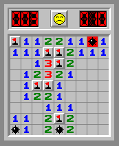

# Minesweeper
## About this version

Added top bar with MS style and some features:
- First click never triggers a bomb
- Flags keep shown after game is over
- Clicking on a cell with correct number of flags around it reveals all adjecent cells (gnome style)
- Time counter
 
> 

## Original version
- **Author :** [Oussama Ben Khiroun](https://oussamabenkhiroun.com/)
- **Language :** JavaScript using [jsboard](https://github.com/danielborowski/jsboard) library (credits to [danielborowski](https://github.com/danielborowski))
- **Algorithm :** Use of recursive grid exploration in case of zero neighbour mines
- **Original Author :** [Oussama Ben Khiroun](https://oussamabenkhiroun.com/)
- **Language :** JavaScript using [jsboard](https://github.com/danielborowski/jsboard) library (credits to [danielborowski](https://github.com/danielborowski))
- **Algorithm :** Use of recursive grid exploration in case of zero neighbour mines
- **Design :** Microsoft (Windows XP) using sprites
- **Source Code :** [https://github.com/ta6o/minesweeper](https://github.com/oussbenk/minesweeper)

## About Minesweeper
[Minesweeper](https://en.wikipedia.org/wiki/Minesweeper_(video_game)) is a single-player puzzle video game. 
The objective of the game is to clear a rectangular board containing hidden "mines" or bombs without detonating any of them, with help from clues about the number of neighboring mines in each field [[Wikipedia]](https://en.wikipedia.org/wiki/Minesweeper_(video_game)).
